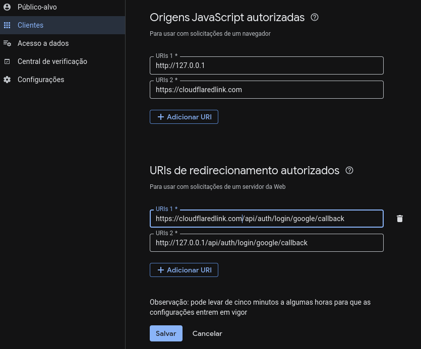

# secspace

A simple authenticated forum, developed with a focus on studying and practicing modern web development concepts.

## Overview

**secspace** is an educational project whose goal is to consolidate knowledge in software architecture, containers, and development best practices. It is not intended to be a final product, but rather a conscious and structured experimentation environment.

Throughout the project, fundamental concepts are applied that frequently appear in real-world medium and large-scale applications.

## Applied concepts and technologies

- Simple container orchestration with **Docker** and **docker-compose**
- **Client-server** architecture
- Layered architecture:
  - Controllers
  - Services (and adapters when necessary)
  - Repositories
- Principles and best practices of:
  - Clean Code
  - Clean Architecture
  - SOLID
- Authentication via **OAuth2 (Google)**

## Future improvements

- Implement caching using **Redis**
- Adopt event-driven architecture to reduce aggressive `GET` request polling
- Improve interface styling

## Installation and configuration

### Important notices

Do not run `pnpm install` on the host.

If this command (or a similar one) is executed by mistake on the host, remember to remove all generated artifacts, such as:

- `node_modules`
- `.next`
- any other directories created at the project root (`secspace`)

These dependencies must be installed **exclusively inside the containers**.

### Prerequisites

- Docker
- Docker Compose
- cloudflared

### Step by step

1. Start the Docker daemon:

```bash
sudo dockerd
````

2. Expose the local service using Cloudflare Tunnel:

```bash
sudo cloudflared --url http://127.0.0.1:80
```

3. Copy the link provided by `cloudflared` and configure the `.env` file, replacing the default API links:

```env
GOOGLE_CALLBACK_URL=https://cloudflaredlinkexemplo.com/api/auth/login/google/callback
NEXT_PUBLIC_API_URL=https://cloudflaredlinkexemplo.com/api
```

4. Configure your Google API credentials:

```env
GOOGLE_CLIENT_ID=exemplo.apps.googleusercontent.com
GOOGLE_CLIENT_SECRET=SenhaSuperForte
```

5. In the **Google Cloud Console**, register the same links defined in:

* `NEXT_PUBLIC_API_URL`
* `GOOGLE_CALLBACK_URL`

These links must be added to the authorized URLs fields to allow the Google OAuth2 screen to be displayed correctly after redirection.

### Google Cloud Console configuration



6. Start the application with Docker Compose:

```bash
sudo docker-compose up --build
```

## Final notes

This project prioritizes architectural clarity and understanding of the application's internal flows, even if this results in more verbose solutions than strictly necessary for a small project. The idea is to study consciously, not just to “make it work”.

---

For more details, see [docs](./docs/secspace.md)

---

## License

MIT License – see [LICENSE](LICENSE) for details.
